# 🏋️ Gym Management System

A complete full-stack Gym Management System built using Java Spring Boot with secure role-based authentication, membership management, attendance tracking, online payment integration, analytics dashboard, blog system, and modern gym workflow automation.

---

# 🚀 Live Features

## 🔐 Authentication & Authorization
- Secure Login & Registration
- Spring Security Authentication
- Role-Based Authorization
- Session Management
- Protected Routes & Dashboards

---

# 👨‍💼 Admin Panel Features

## 👥 User Management
- Users CRUD Operations
- Role Management
- Search, Filter & Pagination
- User Status Control

## 🧑‍🏫 Trainer Management
- Trainers CRUD
- Trainer Assignment
- Trainer Dashboard
- Assigned Members Tracking

## 🧍 Member Management
- Members CRUD
- Membership Activation & Renewal
- Due & Payment Monitoring
- Member Progress Tracking
- Assigned Trainer Management

## 💳 Payment Management
- Manual Payment System
- SSLCommerz Payment Gateway Integration
- Payment History & Reports
- Membership Payment Workflow

## 📅 Attendance Management
- Daily Attendance System
- Bulk Attendance Submission
- Trainer & Member Attendance
- Attendance Reports
- Attendance Analytics

## 🏋️ Exercise & Routine Management
- Exercise CRUD
- Workout Routine Creation
- Exercise Templates
- Routine Assignment

## 🏢 Classes Management
- Gym Classes CRUD
- Schedule Management
- Trainer Assignment
- Public Class Viewing

## 📝 Blog Management
- Blog CRUD
- Categories
- Search & Pagination
- Public Blog System

## 🖼️ Gallery Management
- Photo Upload System
- Video Upload System
- Gallery CRUD
- Public Gallery Showcase

## 📊 Dashboard & Analytics
- Revenue Analytics
- Payment Statistics
- Attendance Insights
- Monthly Reports
- Data Visualization

## 👤 Profile Management
- Admin Profile Update
- Password Update
- Secure Profile System

---

# 🧑‍🏫 Trainer Panel Features
- View Assigned Members
- Manage Member Attendance
- Create Workout Routines
- Exercise Template Management
- Track Member Weight Progress
- Member Details View
- Trainer Profile Management

---

# 🧍 Member Panel Features
- View Attendance History
- View Assigned Trainer
- View Workout Routine
- Membership Details
- Payment History
- Online Membership Payment
- Profile Management

---

# 🌐 Public Website Features
- Home Page
- About Page
- Contact Page
- Membership Package List
- Blog Viewing System
- Gallery Viewing System
- Trainer Showcase
- Class Schedule Viewing
- BMI Calculator
- Responsive Landing Pages

---

# 🛠️ Technologies Used

## Backend
- Java
- Spring Boot
- Spring Security
- Spring Data JPA (Hibernate)

## Frontend
- Javascript
- Thymeleaf
- HTML5
- CSS3
- Bootstrap
- JavaScript

## Database
- H2 Database

## Payment Gateway
- SSLCommerz

## Build Tool
- Gradle

---

# 🧱 Project Architecture

- MVC Architecture
- Service Layer Pattern
- Repository Pattern
- DTO Pattern
- Role-Based Authorization
- Clean Separation of Concerns

---

# 📸 Screenshots

## 🔐 Login Page
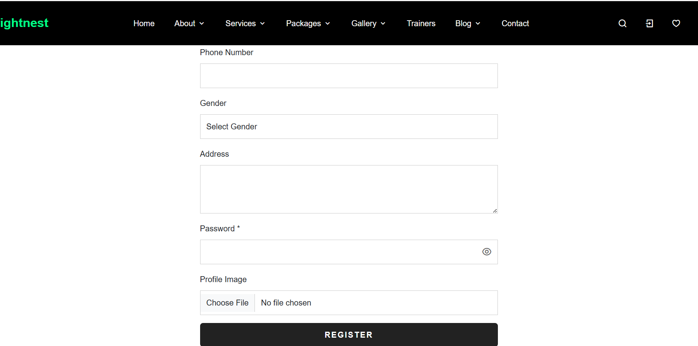

---


## 👨‍💼 Admin Dashboard
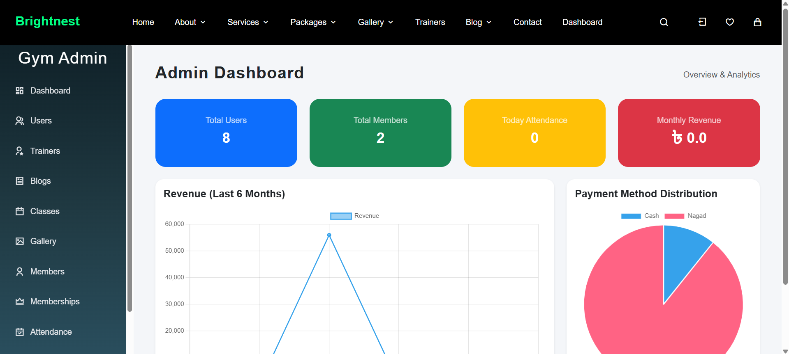

---

## 👥 Users Management
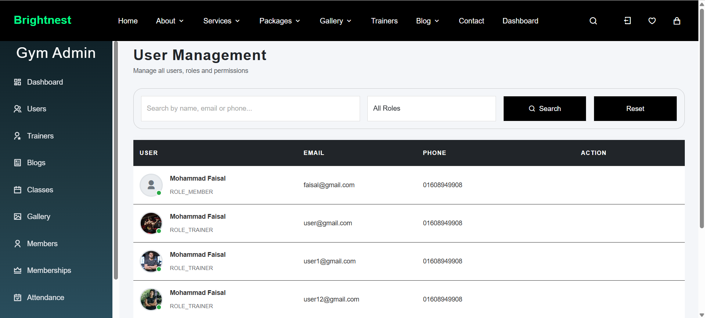

---

## 🧑‍🏫 Trainers Management
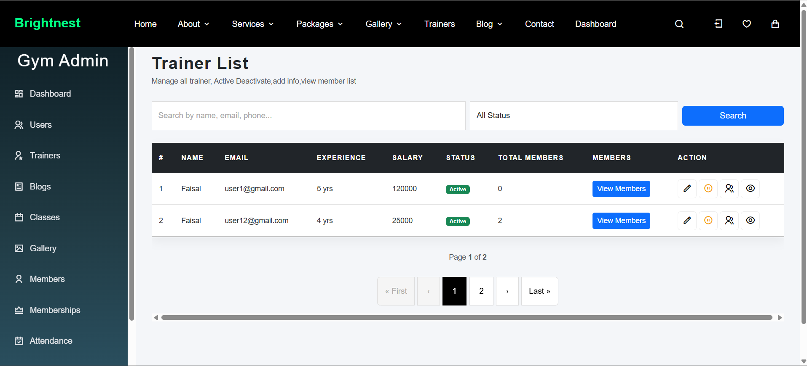

---

## 🧍 Members Management
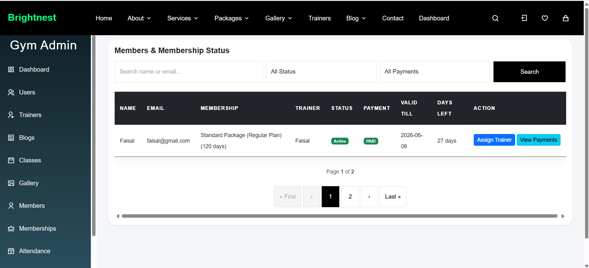

---

## 💳 Payment Management
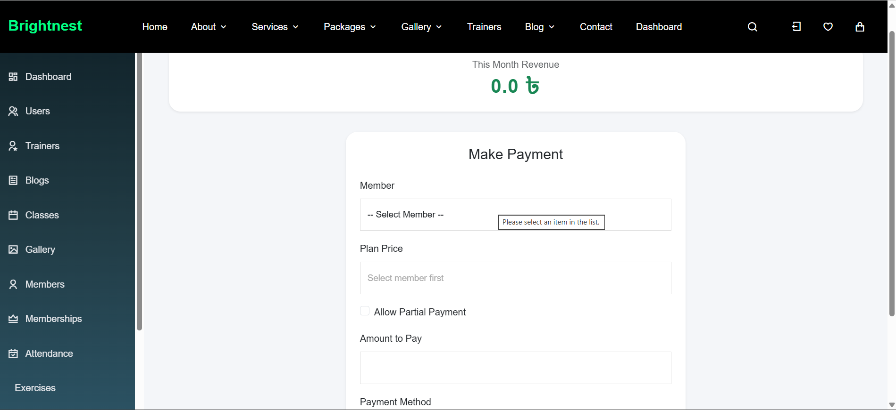

---

## 📅 Attendance Management
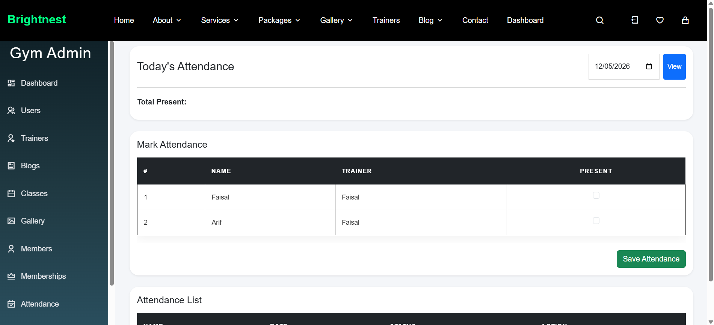

---

## 🏋️ Exercise Management
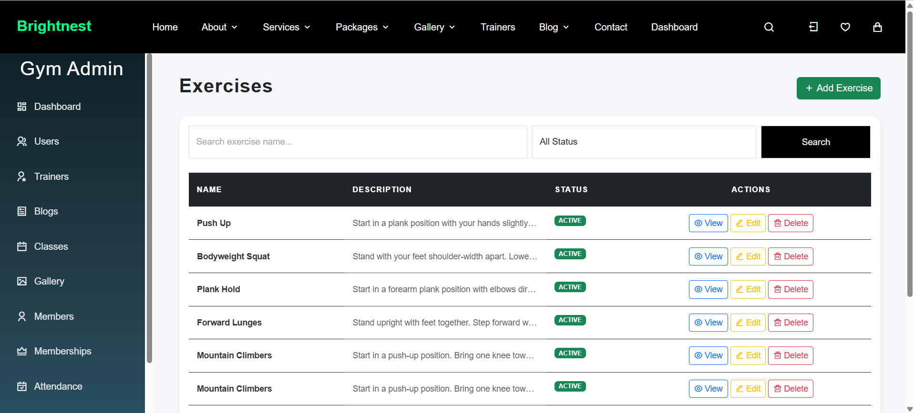

---

## 🏢 Classes Management
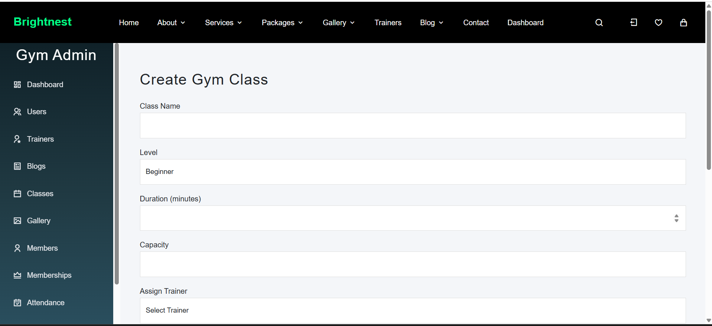

---

## 📝 Blog Management
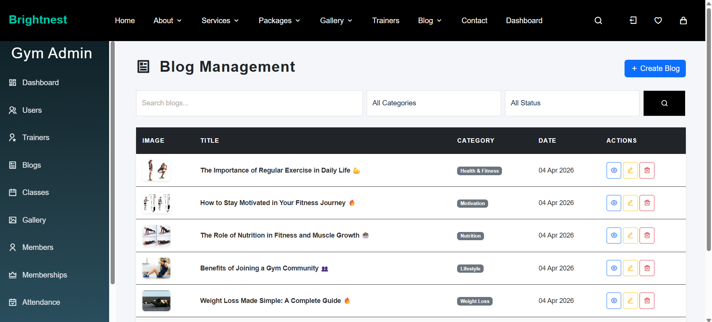

---

## 🖼️ Gallery Management
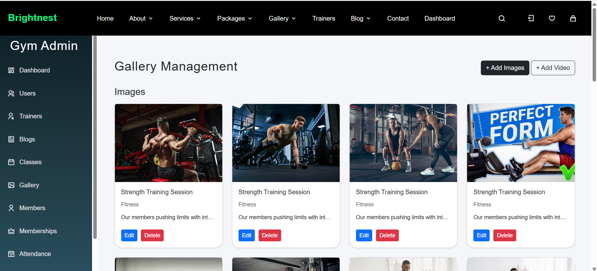

---

## 📊 Analytics Dashboard


---

## 🧑‍🏫 Trainer Dashboard
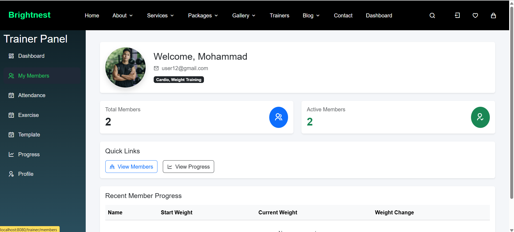

---

## 🧍 Member Dashboard
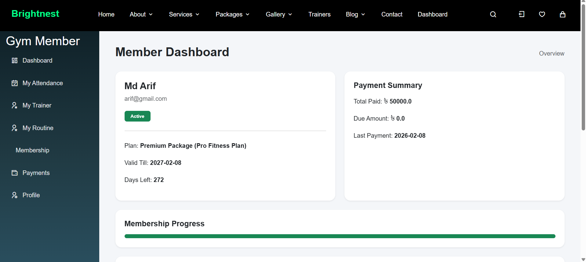

---

## 🏋️ Workout Routine
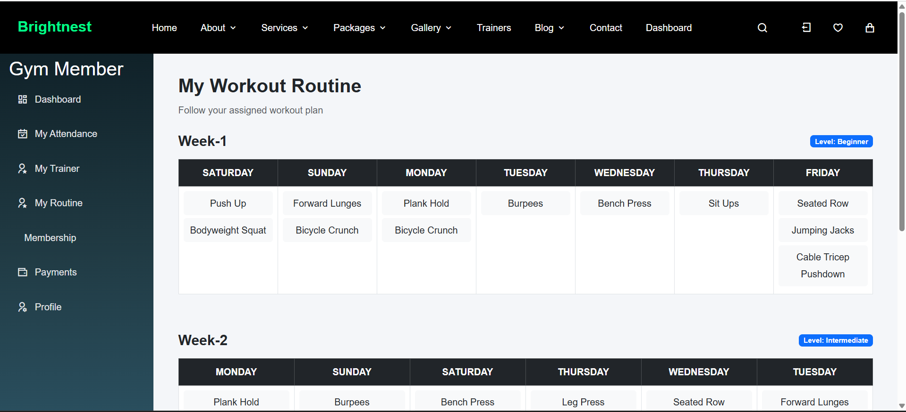

---

## 💪 BMI Calculator
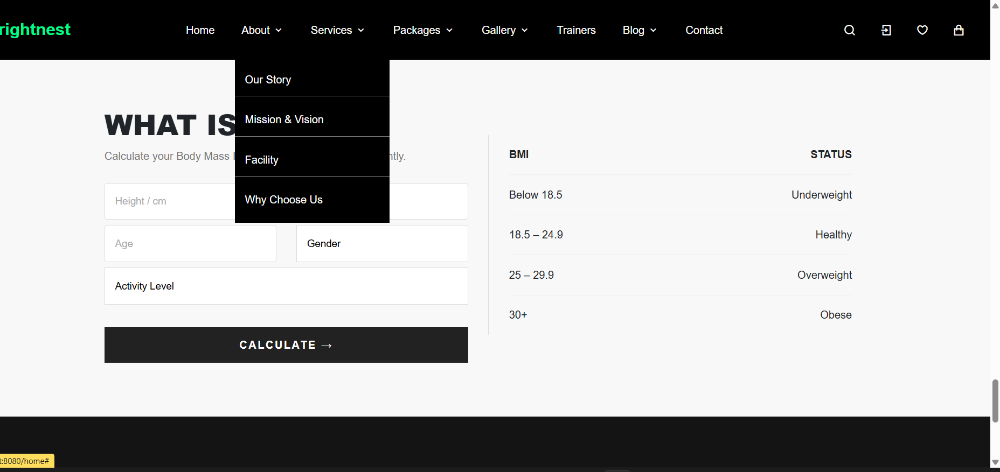

---

## 🌐 Public Blog Page
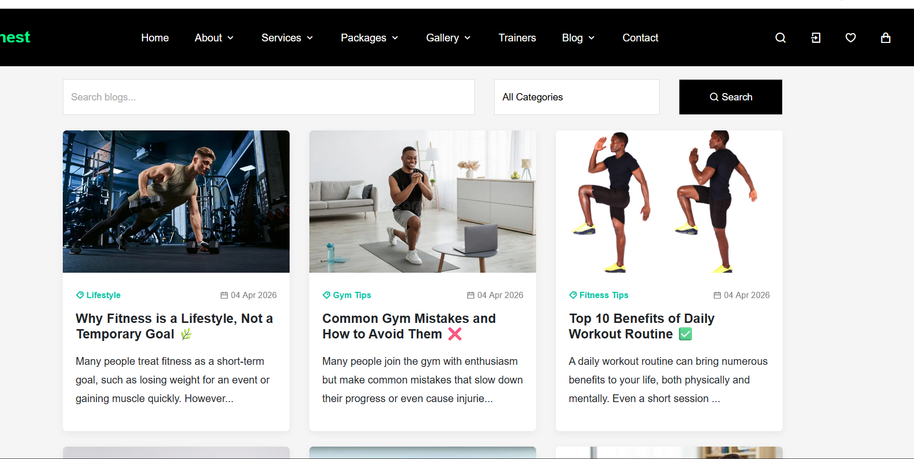

---

## 🖼️ Public Gallery Page


---

## 💳 Online Payment Integration
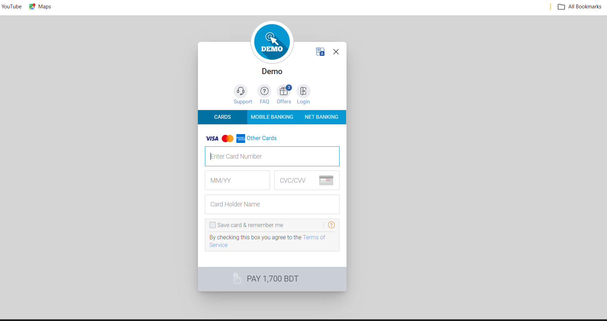

---

# 🎥 Demo Video

## 📺 Project Demo
https://youtu.be/nqAQoV5vFTc

---

# ⚙️ Installation & Setup

## 1️⃣ Clone Repository

```bash
git clone https://github.com/faisal1279/gym_management_system_final
```

---

## 2️⃣ Open Project

Open using:
- IntelliJ IDEA
- Spring Tool Suite
- VS Code

---


# 🔑 Default Roles

- ADMIN
- TRAINER
- MEMBER
- USER

---

# 📚 Learning Outcomes

This project helped me learn:

- Real-world Spring Boot Development
- Secure Authentication Systems
- Payment Gateway Integration
- Database Relationship Management
- MVC Architecture
- Backend Workflow Design
- Dashboard & Analytics Development
- Professional CRUD System Design
- Role-Based Authorization

---

# 🔄 Future Improvements

- REST API Version
- Docker Deployment
- Email Notifications
- Cloud Hosting
- Real-Time Notifications
- Mobile App Integration
- AI-based Fitness Recommendation

---

# 👨‍💻 Developer

## Mohammad Faisal

Aspiring Backend Developer passionate about Java, Spring Boot, scalable backend systems, and real-world software engineering.

- LinkedIn: https://www.linkedin.com/in/mohammad-faisal-b30059237/
- GitHub: https://github.com/faisal1279

---

# ⭐ Support

If you like this project, consider giving it a ⭐ on GitHub.